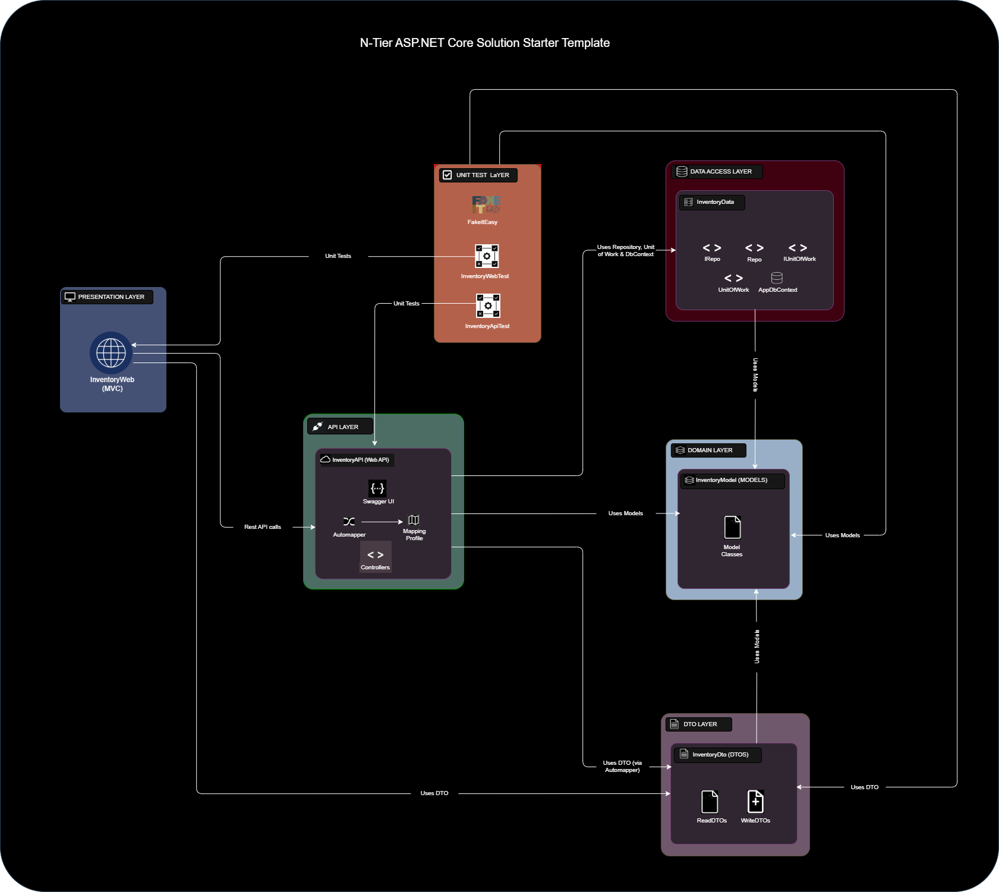
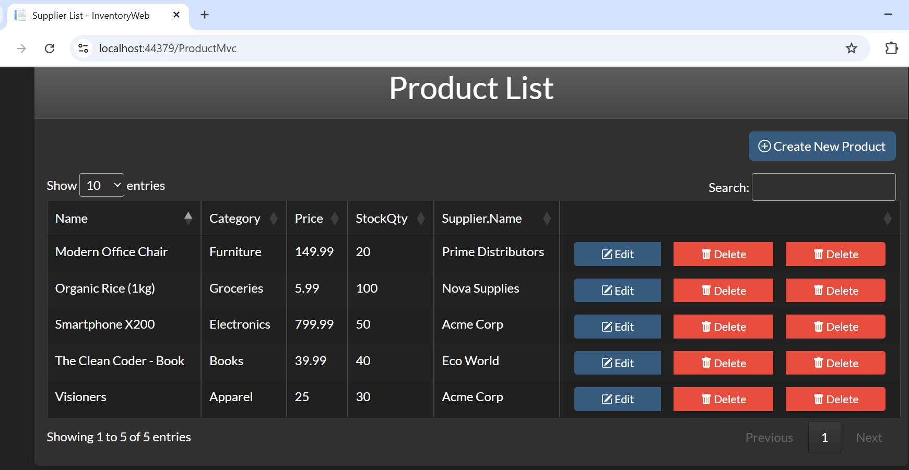
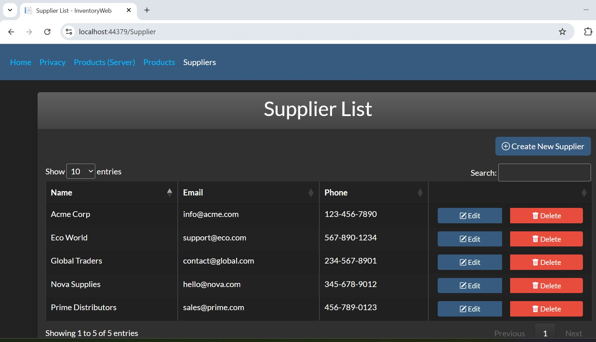

# ASP.NET Multi-Project Starter Template for Modern N-Tier Architecture

This solution is a modern, multi-project ASP.NET software development starter template, designed with a **loosely coupled**, **scalable**, and **testable** architecture. Built in **Visual Studio 2022**, it follows the **N-tier design philosophy**, emphasizing **Separation of Concerns (SoC)** and implementing the **Unit of Work** and **Repository** design patterns.

The template serves as a robust foundation for building professional web applications and centers around two core domain models: **Products** and **Suppliers**.

---

## Project Architecture

See below the architecture diagram of the solution.
 

## 🔧 Solution Structure

### [📁 InventoryModel](./InventoryModel/)

- Contains domain model classes: `Product` and `Supplier`.

### [📁 InventoryDto](./InventoryDto/)

- Defines Data Transfer Objects (DTOs) for read and write operations.
- Ensures clean separation between domain entities and data contracts.

### [📁 InventoryData](./InventoryData/)

- Implements the Repository pattern (`IRepo`, `Repo`) and Unit of Work (`IUnitOfWork`, `UnitOfWork`).
- Includes `AppDbContext` for EF Core integration.

### [📁 InventoryAPI](./InventoryAPI/)

- Exposes RESTful APIs for `Product` and `Supplier` entities.
- Includes **Swagger UI** for interactive API testing and documentation.
- Uses **AutoMapper** for object-to-object mapping.

### [📁 InventoryAPITest](./InventoryApiTest/)

- Provides unit tests for API controller actions.
- Built using **xUnit**, **FakeItEasy**, and **FluentAssertions**.

### [📁 InventoryWeb](./InventoryWeb/)

- An ASP.NET MVC web application that consumes the `InventoryAPI`.
- Offers a front-end interface for managing Products and Suppliers.
   

<i>See screenshots of Products and Suppliers web front-end below:</i>

 

<table style="width: 100%; border-collapse: collapse;">
  <tr>
    <td style="width: 40%; padding: 10px; vertical-align: top; border-right: 1px solid #ddd;">
      
    </td>
    <td style="width: 40%; padding: 10px; vertical-align: top;">
      
    </td>
  </tr>
</table>

 

### [📁 InventoryWebTest](./InventoryWebTest/)

- Contains unit tests for MVC controller actions in the `InventoryWeb` project.
- Uses **xUnit**, **FakeItEasy**, and **FluentAssertions**.

---

## ✅ Key Features

- Follows **N-tier architecture** with clear **project-level separation** to enforce **separation of concerns**
- Implements **Repository** and **Unit of Work** patterns for clean and maintainable data access
- Leverages **AutoMapper** for efficient object-to-object mapping
- Includes unit testing using **xUnit**, **FakeItEasy**, and **FluentAssertions**
- Integrates **Swagger UI** for interactive RESTful API documentation and testing
- Provides a user-friendly **MVC** frontend for rapid development
- Designed for building **scalable**, **maintainable**, and **testable** enterprise-grade applications

---

## 🚀 Getting Started

1. Clone the repository into Visual Studio 2022.
2. Restore NuGet packages.
3. Apply migrations and update the database (via Package Manager Console).

### 🛠️ Visual Studio Configuration (Multi-Startup Projects)

To run the solution correctly in **Visual Studio 2022**, follow these steps:

1. **Right-click the solution** in Solution Explorer and select **"Properties"**.
2. Navigate to **Common Properties > Configure Startup Projects**.
3. Choose **"Multiple startup projects"**.
4. Set the following:
   - `InventoryAPI` → Action: **Start** → Debug Target: **https**. It can only be set to http.
   - `InventoryWeb` → Action: **Start** → Debug Target: **http**, or **https**, or **IIS Express**.
5. Click **OK** to save the settings.
6. Press **F5** or **Ctrl + F5** to run both applications.

---

## 📦 Dependencies

- ASP.NET Core
- Entity Framework Core
- AutoMapper
- Swagger / Swashbuckle
- xUnit
- FakeItEasy
- FluentAssertions

---

## 🧪 Testing

Both the API and MVC layers include unit tests. You can run tests using:

- **Visual Studio Test Explorer**
- CLI: `dotnet test`
